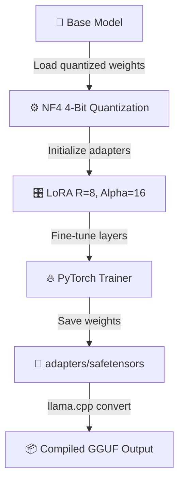

# 🎛️ SLM Fine-Tuning & Quantization Studio
> **Design parameter-efficient fine-tuning pipelines. Generate PEFT QLoRA python scripts, select base models, configure quantization boundaries, and compile GGUF outputs.**

[](https://pradeeptalari14.github.io/portfolio/tools/qlora-tuning/)
[]()

---

## 🎛️ Studio Options — What the UI Generates

The studio has multiple configurable options. Each combination produces different output files.
This repository contains **one working example per option variant** so you can learn by diffing.

### Output Tabs (files the studio generates)
| Tab | Description |
|-----|-------------|
| `finetune.py` | Generated in studio Output tab |
| `requirements.txt` | Generated in studio Output tab |
| `adapters/adapter_config.json` | Generated in studio Output tab |
| `Flow Diagram` | Generated in studio Output tab |

### Configurable Options
| Option | Available Values |
|--------|-----------------|
| **Base Model** | `microsoft/Phi-3-mini-4k-instruct` / `meta-llama/Meta-Llama-3-8B-Instruct` / `mistralai/Mistral-7B-Instruct-v0.2` |
| **LoRA Rank (R)** | `8` / `16` / `32` / `64` |
| **Quantization** | `4-bit (NF4)` / `8-bit` / `none` |
| **Output Format** | `PyTorch Safetensors` / `GGUF` |

---

## 🏗️ Architecture Flow Diagram




---

## 📁 Repository Structure

```
tp-qlora-tuning/
├── README.md          ← This file — complete learning guide
├── examples/phi3-qlora/finetune.py
├── finetune.py
├── requirements.txt
├── scripts/           ← Deployment + validation helpers
└── docs/USAGE.md      ← Extended usage guide
```

---

## 🚀 Step-by-Step Onboarding & Validation Guide

Follow these SRE steps to deploy, validate, and monitor this repository's workspace configs in a local or production environment:

#### 1. Prerequisites
- [x] **Python 3.10+**
- [x] **Docker & Docker Compose**
- [x] **NVIDIA Container Toolkit (optional)**

#### 2. Download
Clone this repository locally:
```bash
git clone https://github.com/Pradeeptalari14/tp-qlora-tuning.git
cd tp-qlora-tuning
```

#### 3. Install
Fetch required packages and compile environment binaries:
```bash
pip install -r requirements.txt || pip install streamlit langchain chromadb fastapi uvicorn
```

#### 4. Enable Automatic Sidecar Injection
Deploy sidecar logging and telemetry containers (e.g. Jaeger agent or Fluentbit) to capture prompt latency and raw model responses.

#### 5. Install Kubernetes Gateway API CRDs
Install Kubernetes Gateway API CRDs to enable canary and load-balanced routing rules between models:
```bash
kubectl apply -f https://raw.githubusercontent.com/kubernetes-sigs/gateway-api/v1.1.0/config/crd/standard/gateway-api-v1.1.0-experimental.yaml
```

#### 6. Deploy Application Workload
Launch the Streamlit app or local FastAPI service mesh:
```bash
streamlit run app.py --server.port 8501
# Or via compose
docker compose up -d
```

#### 7. Validate Application Inside Cluster
Perform standard readiness and health probe checks:
```bash
curl -s -o /dev/null -w "%{http_code}" http://localhost:8501/health || curl -s http://localhost:8501
```

#### 8. Expose Application Using Gateway
Expose Streamlit user interface or gateway router to local dev host:
```bash
kubectl port-forward svc/tp-qlora-tuning 8501:8501
```

#### 9. Access the Application
Access the model playground locally at [http://localhost:8501](http://localhost:8501) and API docs at `/docs`.

#### 10. Install Addons
Install Langsmith/Langfuse tracer proxies and Jaeger telemetry collection agents.

#### 11. Access Dashboard
Access Streamlit web interface or MLflow experiment models tracker on port 5000.

#### 12. View Service Mesh Graph
View the prompt-completion trace trees, agent step flows, and embeddings retrievable lists via web consoles.

#### 13. Generate Traffic
Simulate query traffic to evaluate prompt metrics:
```bash
for i in {1..20}; do curl -X POST -H "Content-Type: application/json" -d '{"prompt": "Test SRE load"}' http://localhost:8501/query; sleep 0.5; done
```

#### 14. Project Structure
```text
tp-tp-qlora-tuning/
├── .gitignore                # Version control exclusions
├── LICENSE                   # MIT Open Source License
├── SECURITY.md               # Vulnerability reporting protocols
├── CHANGELOG.md              # Releases version history
├── README.md                 # Project learning guide & onboarding
├── .env.example              # Template parameters config
├── .pre-commit-config.yaml   # Gitleaks & lint pipeline hooks
├── docs/
│   ├── USAGE.md              # Extended developer usage docs
│   ├── TROUBLESHOOTING.md    # Failures resolution guide
│   ├── GLOSSARY.md           # SRE domain terminology index
│   ├── COMPLIANCE.md         # Legal and security checks checklist
│   └── sre_architecture_flow.png # Category SRE architecture diagram
├── scripts/
│   └── validate.sh           # Local validation helper script
└── .github/
    ├── CONTRIBUTING.md       # Contributing instructions
    ├── PULL_REQUEST_TEMPLATE.md # Pull request code compliance check
    ├── ISSUE_TEMPLATE/       # Bug and features tickets
    ├── dependabot.yml        # Auto updates dependencies
    └── workflows/
        └── security-scan.yml # Gitleaks/yamllint/shellcheck scans

# Primary Config File: finetune.py
```

#### 15. Observability Components
Exports prometheus metrics for prompt latency, tokens processed count, active model parameters, and error rates.

#### 16. Install Monitoring
Sets up notification thresholds for prompt latencies exceeding 2.0s or health status failures.

---

## 📖 How Each Option Changes the Output

### Base Model
- **`microsoft/Phi-3-mini-4k-instruct`** — see `examples/` folder for generated output
- **`meta-llama/Meta-Llama-3-8B-Instruct`** — see `examples/` folder for generated output
- **`mistralai/Mistral-7B-Instruct-v0.2`** — see `examples/` folder for generated output

### LoRA Rank (R)
- **`8`** — see `examples/` folder for generated output
- **`16`** — see `examples/` folder for generated output
- **`32`** — see `examples/` folder for generated output
- **`64`** — see `examples/` folder for generated output

### Quantization
- **`4-bit (NF4)`** — see `examples/` folder for generated output
- **`8-bit`** — see `examples/` folder for generated output
- **`none`** — see `examples/` folder for generated output

### Output Format
- **`PyTorch Safetensors`** — see `examples/` folder for generated output
- **`GGUF`** — see `examples/` folder for generated output

---

## 💡 SRE Compliance & Best Practices

| SRE Compliance Pillar | ❌ Anti-Pattern | ✅ Production Best Practice |
|---|---|---|
| **Secrets Protection** | Committing passwords or dynamic tokens to repositories | Exclude sensitive files in `.gitignore` and reference Vault parameters |
| **Deployment Auditing** | Manual ad-hoc server updates | Enforce infrastructure validation and continuous deployment pipelines |

## 🔐 Security Standards

- ❌ Never commit credentials, API keys, or database passwords directly to Git repositories.
- ✅ Reference dynamic parameters using cloud Secret Managers (Vault, AWS SSM Parameter Store, Key Vault).
- ✅ Enforce branch protection rules: require peer pull request reviews and green status checks.

---

## 📖 Resources

| Resource | Link |
|----------|------|
| Interactive Studio | [Open →](https://pradeeptalari14.github.io/portfolio/tools/qlora-tuning/) |
| All 91 Studios | [Dashboard →](https://pradeeptalari14.github.io/portfolio/tools/) |
| SRE Provisioning Guide | [Handbook →](https://github.com/Pradeeptalari14/portfolio/blob/main/GITHUB_PROVISIONING_GUIDE.md) |

---
*Generated by [SLM Fine-Tuning & Quantization Studio Studio](https://pradeeptalari14.github.io/portfolio/tools/qlora-tuning/) — [Talari Pradeep Portfolio](https://pradeeptalari14.github.io/portfolio)*